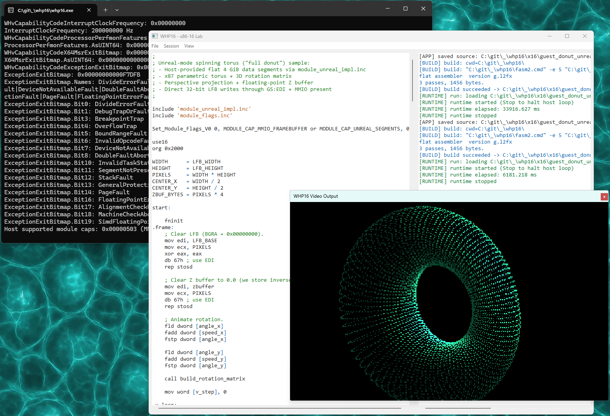

# WHP_x16

Windows GUI lab for editing, building, and executing 16-bit x86 modules on WHP (Windows Hypervisor Platform).

## What It Does

- Edit `.asm` source in-app
- Build via external `fasm2.cmd`
- Run module binaries in WHP
- Show MMIO console output and LFB video output
- Capture runtime exits/capabilities for debugging and discovery

## Quick Start

1. Launch `whp16.exe`.
2. Use `File -> New Module`.
3. Save with `File -> Save Assembly As...`.
4. Build with `Session -> Build`.
5. Run with `Session -> Run`.
6. Stop long-running guests with `Session -> Stop`.

## Useful Settings

- `View -> Settings...`
  - `fasm2 command line template`
  - log/highlight colors
  - LFB clear color
  - `Present min ms` throttle (`0` = off, `16` = ~60 Hz pacing)
